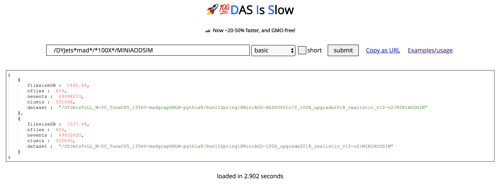

<a href="http://uaf-8.t2.ucsd.edu/~namin/dis"></a>

## Installation

* Clone this repository into your `~/public_html/` directory. 

### Permissions
* Make sure all python files have `chmod 755` including the directories they reside in. (`chmod 755 ../dis/`)
* Make sure your `~/public_html/.htaccess` file has the following content
```
AddHandler cgi-script .cgi .py
Options +ExecCGI
```
* Continue with the next sections

### Initial test
* Make a fresh proxy and copy the file to the same directory: `cp /tmp/x509up_u$(id -u) .`
* Visit the corresponding URL for `index.html` in the browser and verify that it loads.
* Edit the URL near the top of `dis_client.py` to match the web location and run `./dis_client.py --test -` to run some unit tests for the various query types.
* Run `python db.py` to test the sqlite interface. If all goes well, you should see a tacky `Calculations correct` message (just like in The Martian).
* Copy the appropriate `allsamples.db` if you want to populate the database with previous samples.
* Follow the crontab/proxy instructions in the next section, and that's it.

### Crontab/auto-renewing proxy

* Follow instructions from this [Twiki](http://www.t2.ucsd.edu/tastwiki/bin/view/CMS/LongLivedProxy) to create an auto-renewing proxy. Very handy.

* As `dis` uses a user proxy to make queries, you need to make sure there's always a fresh one at your disposal. Put the below lines into your crontab (`crontab -e`)
```bash
* 55 15 * * * /home/users/${USER}/cron/renewProxy.sh >/dev/null 2>&1
* 58 15 * * * cp /tmp/x509up_u$(id -u) /home/users/${USER}/public_html/dis/
```
Note that the first entry should correspond to the long-lived proxy setup.

## Usage instructions and examples

A query has 3 parts: the query string, the query type, and the boolean "short" option (which governs the level of detail that is returned by the API).


### General notes

* Wildcards are accepted (`*`) for most queries where you'd want to use wildcards. Just try it.
* `dis_client.py` syntax will be used here, but of course they have obvious mappings to use them on the website 
* I recommend putting `dis_client.py` on your PATH (and PYTHONPATH) somewhere.


### Query types

#### basic

`
dis_client.py -t basic /GJets_HT-600ToInf_TuneCUETP8M1_13TeV-madgraphMLM-pythia8/RunIISpring15DR74-Asympt25ns_MCRUN2_74_V9-v1/MINIAODSIM
`

* Here, you will see an output of the number of events in the dataset, the number of files, number of lumi blocks, and dataset file size.
* Also note that the `-t basic` is default, so you don't need to do it for this basic query type.

`
dis_client.py "/GJets_HT-*_TuneCUETP8M1_13TeV-madgraphMLM-pythia8/RunIISpring15DR74-Asympt25ns_MCRUN2_74_V9-v1/MINIAODSIM"
`

* The wildcard now will cause the output to be a list of matching dataset names.
* If you put `,all` after the dataset pattern, you will also see the samples not yet marked as "valid" in DBS

`
dis_client.py --detail "/GJets_HT-*_TuneCUETP8M1_13TeV-madgraphMLM-pythia8/RunIISpring15DR74-Asympt25ns_MCRUN2_74_V9-v1/MINIAODSIM"
`

* Specifying `--detail` (equivalently, unchecking `short` in the web interface) will show the number of events, number of files, etc. for each dataset matching the wildcard.

#### files

`
dis_client.py -t files /GJets_HT-600ToInf_TuneCUETP8M1_13TeV-madgraphMLM-pythia8/RunIISpring15DR74-Asympt25ns_MCRUN2_74_V9-v1/MINIAODSIM
`

* This will show a list of a handful of the files from this dataset, along with filesize and number of events. To show all the files, provide the `--detail` option (note that sometimes, you can get thousands of files since datasets can be large, which is why the default is only a handful, which suits my main use case which is to check one file in a dataset for something specific).

#### config

`
dis_client.py -t files /GJets_HT-600ToInf_TuneCUETP8M1_13TeV-madgraphMLM-pythia8/RunIISpring15DR74-Asympt25ns_MCRUN2_74_V9-v1/MINIAODSIM
`

* Shows information about the CMSSW version and global tag used for processing this dataset

#### mcm

`
dis_client.py -t mcm /GJets_HT-600ToInf_TuneCUETP8M1_13TeV-madgraphMLM-pythia8/RunIISpring15DR74-Asympt25ns_MCRUN2_74_V9-v1/MINIAODSIM
`

* This shows basic MCM information (for ALL information, throw it the detail option) for the OLDEST PARENT of the dataset (presumably GENSIM)
* This includes the fragment, cross-section, matching/filter efficiency, CMSSW release, MCDB ID, and dataset status (done, running, etc.)

`
dis_client.py -t mcm "/GJets_HT-600ToInf_TuneCUETP8M1_13TeV-madgraphMLM-pythia8/RunIISpring15DR74-Asympt25ns_MCRUN2_74_V9-v1/MINIAODSIM,this"
`

* To get MCM information for the actual dataset you feed in, tack on the `,this` modifier

#### driver

`
dis_client.py -t driver /GJets_HT-600ToInf_TuneCUETP8M1_13TeV-madgraphMLM-pythia8/RunIISpring15DR74-Asympt25ns_MCRUN2_74_V9-v1/MINIAODSIM
`

* Same story as above (finds the cmsDriver commands for the highest parent, unless you give it the `,this` modifier)


#### parents

`
dis_client.py -t parents /GJets_HT-600ToInf_TuneCUETP8M1_13TeV-madgraphMLM-pythia8/RunIISpring15DR74-Asympt25ns_MCRUN2_74_V9-v1/MINIAODSIM
`

* Returns a list of datasets found as we recurse up the tree of parenthood


#### lhe

`
dis_client.py -t lhe /GJets_HT-600ToInf_TuneCUETP8M1_13TeV-madgraphMLM-pythia8/RunIISpring15DR74-Asympt25ns_MCRUN2_74_V9-v1/MINIAODSIM
`

* Returns a list of LHE files for this dataset (only a few are returned unless `--detail` is asked for, in the same way as the files query type)


#### snt

`
dis_client.py -t snt "/GJets_HT-*_TuneCUETP8M1_13TeV-madgraphMLM-pythia8/RunIISpring15DR74-Asympt25ns_MCRUN2_74_V9-v1/MINIAODSIM"
`

* Much like the other database queries, this just uses the SNT datasets (returns information about ntupled nevents, cross-section, kfactor, hadoop location, etc.)
* The `--detail` option just provides more details like the filter type, twiki name, who the sample was assigned to, etc.


#### dbs

`
dis_client.py -t dbs "https://cmsweb.cern.ch/dbs/prod/global/DBSReader/files?dataset=/DYJetsToLL_M-50_TuneCUETP8M1_13TeV-amcatnloFXFX-pythia8/RunIISpring16MiniAODv1-PUSpring16_80X_mcRun2_asymptotic_2016_v3-v1/MINIAODSIM&detail=1&lumi_list=[134007]&run_num=1"
`

* For development use, or other cases not covered here, you can feed in a direct URL for a DBS query.


#### runs

`
dis_client.py -t runs "/SinglePhoton/Run2016E-PromptReco-v2/MINIAOD"
`

* Returns a list of runs contained within the dataset
* Hint: try `dis_client.py -t runs "/SinglePhoton/Run2016E-PromptReco-v2/MINIAOD | stats"` to see the first, last, and number of runs.


#### pick

`
dis_client.py -t pick "/MET/Run2016D-PromptReco-v2/MINIAOD,276524:9999:2340928340,276525:2892:550862893,276525:2893:823485588,276318:300:234982340,276318:200:234982340"
`

* This is a parallelized edmPickEvents which returns the files containing the specified events


#### pick\_cms4

`
dis_client.py -t pick_cms4 "/MET/Run2016D-PromptReco-v2/MINIAOD,276524:9999:2340928340,276525:2892:4845251498,276525:2893:823485588,276318:300:234982340,276318:200:234982340"
`

* This is a pickEvents implementation for CMS4 data which returns the merged files containing the specified events

#### sites

`
dis_client.py -t sites "/MET/Run2016D-PromptReco-v2/MINIAOD"
`

* Gives phedex information about a dataset or even a `/store/` file, including the replication sites.


### Selectors/modifiers, greppers, and all that

`
dis_client.py -t snt "/gjet*,cms3tag=*V08*,gtag=*v3 | grep location,cms3tag,gtag,xsec"
`

* This uses a selector and grepper to show all Gjet SNT samples that have a cms3tag containing V08 and global tag ending with v3. The "cms3tag" name comes from the return value when doing a normal query, so you can find all the values that are selectable by making an inclusive query. Same goes for the grep fields which limit what is shown to you in the return information.
* But Nick, this looks ugly and I can't copy and paste the output easily into other scripts. It would be nice if we could put the same information for each sample on the same line. Fear not. There is a `--table` option which puts the results into a pretty table with nice columns.

`
dis_client.py -t snt "/gjet*,cms3tag=*V08*,gtag=*v3 | grep location,cms3tag,gtag,xsec" --table
`

For a more practical application, what if we want to get the total number of events for all HT binned GJet samples in CMS3?

`
dis_client.py -t snt "/gjet*ht-*/*/*,cms3tag=*V08* | grep nevents_out"
`

* This is a start. We see one column of numbers with the "nevents_out" field. What if we could add them together and display some statistics?

`
dis_client.py -t snt "/gjet*ht-*/*/*,cms3tag=*V08* | grep nevents_out | stats"
`

* Piping it into `stats`, we get the number of entries, the total, the minimum, and maximum for a list of numbers. More generally, any list of numbers can be piped into `stats`. Same with the run query type above (if we wanted to find the first or last run in a dataset, for example).

* There is also a `sort`.

### SQL tips
* Dump the SNT `.db` file to a csv for quick grepping/visual inspection with `sqlite3 -header -csv allsamples.db "select * from sample;" > out.csv`
* There are many examples of usage at the bottom of `db.py`, in `db_tester.py` and in the `snt`/`update_snt`/`delete_snt` sections of `api.py`.

### API Usage
The primary purpose of this was to provide programmatic access to DBS, MCM, DAS, etc, so the `--json` option can be passed to any `dis_client.py` query to output a json. Even better, if it's on your path, you can import it directly from python and get a dictionary back as the response

```python
import dis_client
response =  dis_client.query(q="..." [, typ="basic"] [, detail=False])
data = response["response"]["payload"]
print response
print data
```
